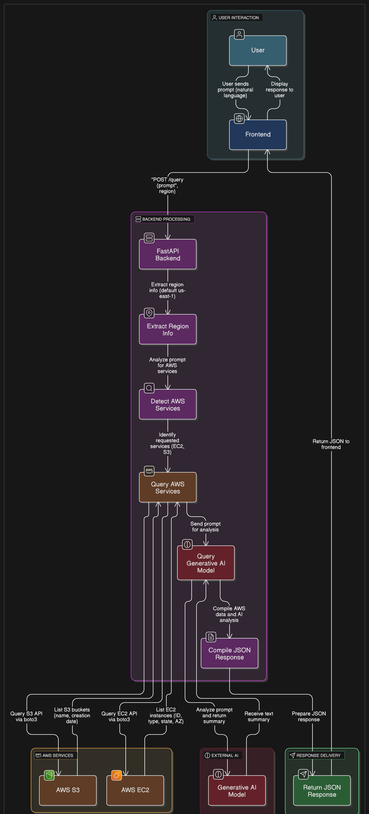
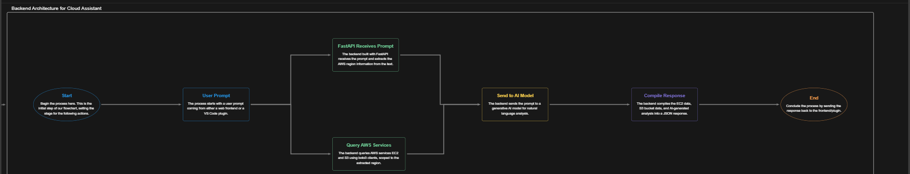
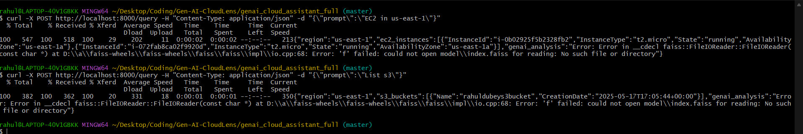

# OutPut 



# GenAI CloudLens - AWS Query Assistant

GenAI CloudLens is a cloud assistant tool that leverages AWS SDK and generative AI to query AWS resources such as EC2 instances and S3 buckets via natural language prompts. It is designed as a backend FastAPI service integrated with a VS Code plugin or any frontend client for seamless AWS resource insights.

---

## Features

- Query AWS services (EC2, S3, etc.) via natural language prompts
- Auto-detect AWS region from user prompts, with a default fallback
- Use AWS SDK (boto3) to fetch live cloud data
- Integrate GenAI to analyze and enhance query responses
- FastAPI backend with CORS enabled for frontend or plugin access

---

## Architecture

```plaintext
+--------------+       HTTP POST       +----------------+
|              | ------------------>  |                |
|  VS Code /   |                      | FastAPI Backend |
|  Frontend    | <------------------  |                |
+--------------+       JSON Response  +----------------+
                              |
                              | Uses boto3 to fetch
                              | AWS data (EC2, S3)
                              |
                     +--------------------+
                     |    AWS Services     |
                     | (EC2, S3, Lambda...)|
                     +--------------------+
                              |
                              | Uses GenAI
                              | for prompt analysis
                              v
                   +-----------------------+
                   | Generative AI Model(s) |
                   +-----------------------+


---

